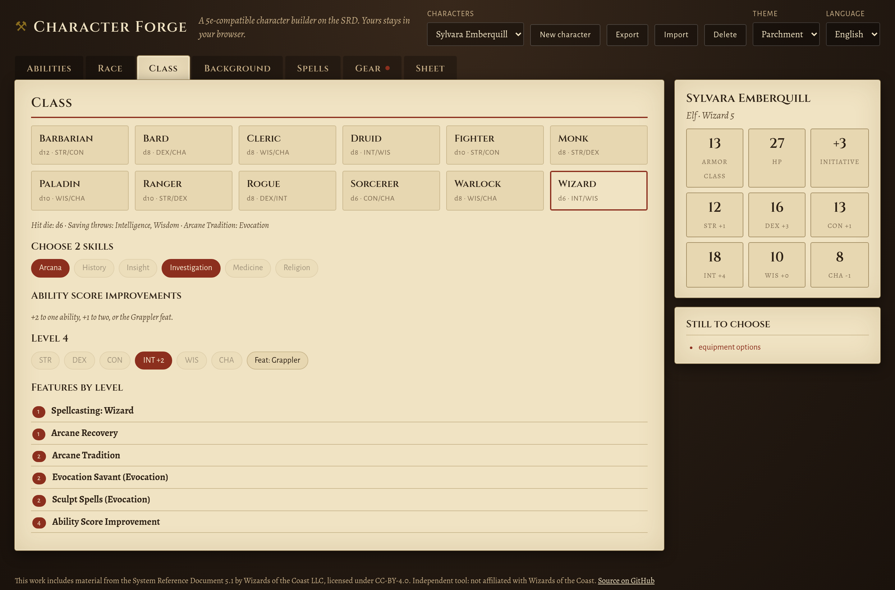
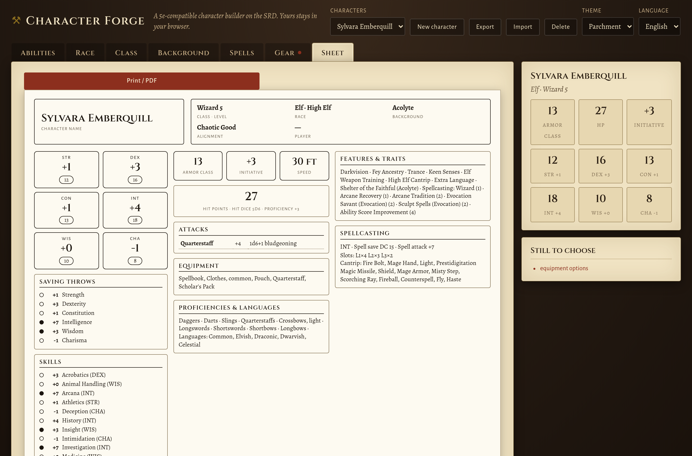
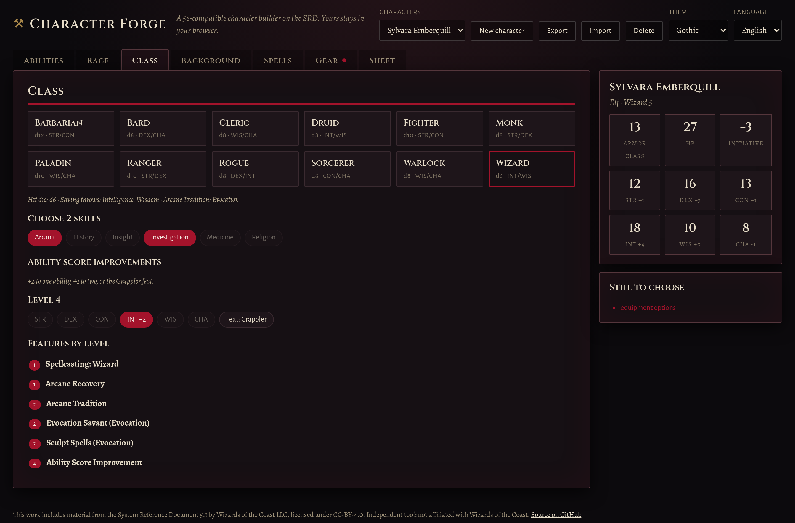
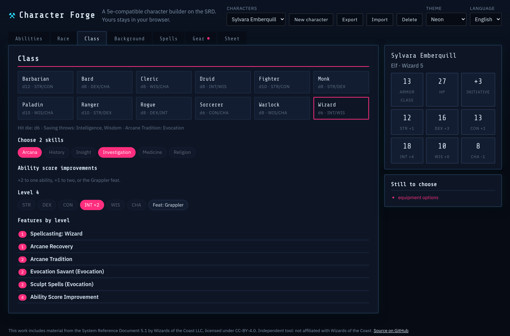

<h1 align="center">Character Forge</h1>

<p align="center">
  <b>A 5e-compatible character builder in the browser, built on the SRD 5.1.</b><br>
  Guided steps from ability scores to spells, a live rules engine that recomputes everything as you choose,
  and a printable character sheet. Three tabletop themes. Works offline; your characters never leave your browser.
</p>

<p align="center">
  
</p>

**Live:** https://ardakalper.github.io/character-forge/

## Features

- **All 12 SRD classes, levels 1–20:** hit dice, saving throws, skill choices, expertise (rogue and bard),
  every class and subclass feature by level, class tables (rage, ki, sneak attack, sorcery points, invocations…),
  and ability score improvements at the right levels: +2, +1/+1 or the SRD's Grappler feat.
- **9 races with subraces and traits,** racial ability bonuses, extra-language and skill choices (half-elf,
  high elf, dwarf tool proficiencies and the rest).
- **Ability scores three ways:** standard array with automatic swapping, 27-point buy with live budget,
  or manual entry. Racial bonuses and ASIs stack visibly, capped at 20.
- **A real rules engine:** armor class from what you actually carry (heavy armor ignoring Dex, shields,
  barbarian and monk Unarmored Defense), attack and damage bonuses (finesse and ranged pick the right ability,
  monk martial arts die by level), saves, skills, initiative, passive Perception, hit points (max at level 1,
  average or max after).
- **Spellcasting per class:** slot tables including warlock pact magic, cantrips known, spells known (bard,
  ranger, sorcerer, warlock) or prepared counts (cleric, druid, wizard, paladin), save DC and attack bonus,
  ritual and concentration tags, full spell text with search.
- **Starting equipment as choices,** including "any martial weapon" category picks, with pack contents listed.
- **A live "still to choose" list** so a character is never silently incomplete; tabs show a dot until their
  choices are done.
- **Printable sheet:** a classic three-column sheet rendered from the data, always ink-on-paper, A4 landscape
  via the browser's print dialog.
- **Three themes:** Parchment (leather and scroll), Gothic (candle-lit black and blood red), Neon (night-city
  cyber). Pick whichever fits the table; the sheet stays printable.
- **Many characters,** autosaved to the browser, JSON export and import.
- English and Turkish interface. Rules text stays in English, as published.
- Plain HTML, CSS and ES modules. No build step, no runtime dependencies.

<p align="center">
  
</p>

<p align="center">
  
</p>

## Run it locally

```sh
git clone https://github.com/ardakalper/character-forge
cd character-forge
npm start            # serves app/ on http://localhost:4176
```

## Tests

```sh
npm install
npm run test:unit    # rules engine + data integrity: 12 classes × 20 levels, every feature resolves,
                     # point buy, HP, AC, attacks, slots, pending-choice tracking, i18n parity
npm run test:e2e     # Playwright: full fighter and wizard builds through the UI, ASI and feat picks,
                     # persistence, export / import, themes, Turkish
```

Set `PW_CHROMIUM_PATH=/path/to/chrome` to reuse an installed Chromium. CI runs both suites on every push and
deploys `app/` to GitHub Pages when `main` is green.

## How it is built

```
app/
  index.html        shell: header, step tabs, content, summary and to-do panels
  css/app.css       the three themes as token sets on :root[data-theme]
  css/sheet.css     the character sheet, on screen and in print
  data/*.json       compiled SRD 5.1 content (584 KB): races, classes, spells, equipment…
  js/rules.js       the pure rules engine; every derived number lives here
  js/sheet.js       renders the printable sheet from a character
  js/main.js        the step UI: widgets, tabs, persistence, export / import
  js/i18n.js        English and Turkish
tools/build-data.mjs  compiles app/data from the 5e-bits/5e-database JSON
tests/                node:test unit suite and Playwright e2e specs
```

Data pipeline: `tools/build-data.mjs` reads the [5e-bits/5e-database](https://github.com/5e-bits/5e-database)
JSON (the dataset behind dnd5eapi), resolves proficiency and equipment option trees into compact structures,
and writes `app/data/`. The output is committed, so the site itself has no build step and works offline as a PWA.

## Scope and roadmap

v1 is single-class, SRD 5.1 (2014 rules). Multiclassing, the 2024 SRD 5.2 content, more printable layouts and
custom backgrounds are the obvious next steps.

## Legal

This work includes material from the System Reference Document 5.1 ("SRD 5.1") by Wizards of the Coast LLC,
available at https://dnd.wizards.com/resources/systems-reference-document. The SRD 5.1 is licensed under the
Creative Commons Attribution 4.0 International License, https://creativecommons.org/licenses/by/4.0/legalcode.

Character Forge is an independent tool, not affiliated with or endorsed by Wizards of the Coast. It ships only
SRD content. Fonts (Cinzel, Alegreya, Alegreya Sans, IBM Plex Sans, Share Tech Mono) are bundled as subsetted
woff2 files under the SIL Open Font License 1.1. Code is MIT.

---

### Türkçe özet

**Character Forge**, tarayıcıda çalışan, SRD 5.1 üstüne kurulu 5e uyumlu bir karakter oluşturucu. Yetenek
puanlarından büyülere adım adım ilerlersin; kural motoru her seçimde zırh sınıfını, saldırıları, kurtarma ve
beceri bonuslarını, can puanını ve büyü slotlarını yeniden hesaplar. 12 sınıf (1–20. seviye, tüm özellikler ve
alt sınıflar), 9 ırk ve alt ırklar, standart dizi / 27 puanlık alım / elle giriş, uzmanlık, ASI ve Grappler
yetisi, kategori dahil başlangıç teçhizatı seçimleri, sınıfa göre büyücülük (warlock pact magic dahil) var.
"Seçilmesi kalanlar" listesi karakteri eksik bırakmaz. Klasik görünümlü karakter sayfası yazdırılır (PDF).
Üç tema: Parşömen, Gotik, Neon. Karakterler tarayıcıya kaydedilir, JSON olarak dışa ve içe aktarılır; site
çevrimdışı çalışır. Türkçe ve İngilizce arayüz (kural metinleri yayınlandığı gibi İngilizce).
